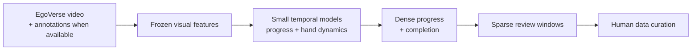
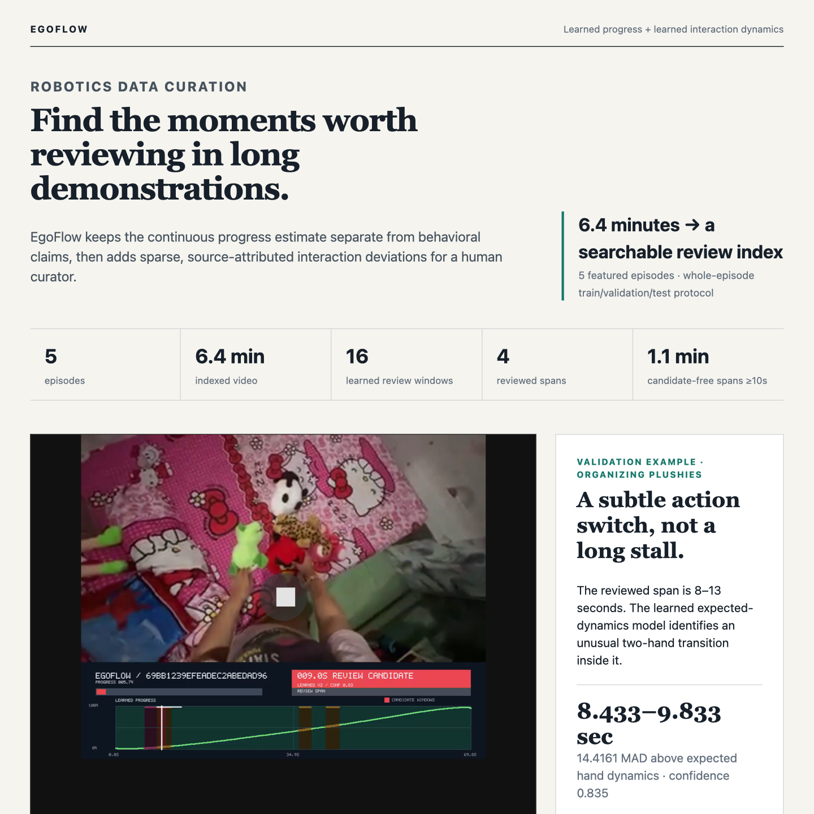

# EgoFlow

EgoFlow turns long egocentric robot demonstrations into a learned progress trace,
an episode completion score, and a short queue of moments worth reviewing.

> **Result:** 18 public EgoVerse episodes (25 minutes) were processed end to end.
> A strict 12/3/3 episode split produced ordered completion scores for 25/50/75/100%
> prefixes, while five full scored demonstrations are available below.



[](https://github.com/surajrdy/EgoFlow/releases/tag/v0.1-demo)

### Scored videos

| Episode | Task | Demo |
|---|---|---|
| `69bb1239efeadec2abedad96` | Organizing plushies · Angry Bird | [▶ Watch scored video](https://github.com/surajrdy/EgoFlow/releases/download/v0.1-demo/69bb1239efeadec2abedad96-scored.mp4) |
| `69bb0986d738810497993b87` | Organizing dishes | [▶ Watch scored video](https://github.com/surajrdy/EgoFlow/releases/download/v0.1-demo/69bb0986d738810497993b87-scored.mp4) |
| `69bb12294012b22f2ea5f5a6` | Dishwashing | [▶ Watch scored video](https://github.com/surajrdy/EgoFlow/releases/download/v0.1-demo/69bb12294012b22f2ea5f5a6-scored.mp4) |
| `69bb0c7e411dd3347c32cacf` | Organizing cutlery | [▶ Watch scored video](https://github.com/surajrdy/EgoFlow/releases/download/v0.1-demo/69bb0c7e411dd3347c32cacf-scored.mp4) |
| `69bb11f51e737760229bc606` | Organizing dishes | [▶ Watch scored video](https://github.com/surajrdy/EgoFlow/releases/download/v0.1-demo/69bb11f51e737760229bc606-scored.mp4) |

[Download all five videos](https://github.com/surajrdy/EgoFlow/releases/tag/v0.1-demo).

## Why

A demo can finish successfully while containing retries, backtracking, or abandoned
actions. A single success label hides those moments, and watching every frame does
not scale. EgoFlow provides a searchable review queue while preserving the full
continuous progress signal.

## Method

Frozen visual features feed a two-layer BiGRU trained with temporal ranking,
endpoint, and smoothness losses. A second self-supervised GRU predicts short-horizon
2D hand dynamics from position, aperture, and velocity. The models are small enough
to retrain in seconds once features are cached.

The adapter supports EgoVerse Zarr, existing DINO features, and Qwen annotations.
This public run used MP4 video, frozen DINOv2 features, and task text because dense
semantic Zarr annotations were unavailable. It therefore learns **single-stage
coarse progress**, not hierarchical semantic progress.

## Hesitation / Recovery Detection

The interface separates the learned continuous signals from their interpretation:

- **Learned:** progress, completion, and expected hand dynamics.
- **Derived review candidates:** unusual slowdowns, regressions, recoveries, and
  interaction transitions computed from temporal changes in those signals.
- **Human validation:** reviewed timestamps used for evaluation, never as training
  targets.

Ordinary slow motion is not labeled `STALL`, and positive motion is not automatically
called `PRODUCTIVE`. The dashboard stays neutral except for sparse candidate windows.

## Distributed Pipeline

```text
videos / authorized Zarr
        → up to 8 Modal feature workers
        → cached frozen features
        → 1–2 H100 temporal-head trainers
        → scores, videos, timelines, review database
```

The frozen run used a whole-episode 12 train / 3 validation / 3 blind-test split.
Angry Bird remained in validation; the test episodes were marked unreviewed before
prediction. Training stopped at step 400 and took 15.35 seconds on one H100.

## Results

| Measure | Result |
|---|---:|
| Public data processed | 18 episodes / 25.0 min |
| Featured scored demos | 5 episodes / 6.4 min |
| Completion at 25/50/75/100% prefixes | 0.913 / 0.943 / 0.956 / 0.961 |
| Manually tagged events recovered | 5 / 8 |
| Review queue on that subset | 59.25 s of 8.9 min |
| Frozen blind-test top five | 1 correct / 2 ambiguous / 2 incorrect |

The completion ordering is sensible but weakly separated. Event numbers come from a
tiny audit and position EgoFlow as a **review prioritization tool**, not a production
behavior classifier. Reproducible records are in
[`blind_test_metrics.json`](hackathon/egoflow/results/blind_test_metrics.json) and
[`frozen_split.json`](hackathon/egoflow/results/frozen_split.json).

## Quickstart

Python 3.11+:

```bash
pip install -e .
python scripts/smoke_test.py
python scripts/run_demo.py --episode 69bb1239efeadec2abedad96
```

The smoke test performs a disposable CPU train-and-score pass. The demo is offline
and uses the bundled hero result.

## Reproducing the Demo

Modal authentication is required; ElevenLabs is not used.

```bash
# Two-episode smoke
modal run hackathon/egoflow/modal_app.py --action smoke --max-episodes 2 --max-steps 20

# Full selected set
modal run hackathon/egoflow/modal_app.py \
  --action full \
  --episode-ids-file hackathon/egoflow/episode_selection.csv \
  --max-episodes 18 --max-steps 750 --training-runs 1
```

See [`hackathon/egoflow/README.md`](hackathon/egoflow/README.md) for local Zarr
extraction, training, and scoring commands. Caches, checkpoints, datasets, and videos
are excluded from Git history.

## Manual Evaluation

Build the five-video SQLite-backed presentation dashboard:

```bash
uv run python -m hackathon.egoflow.scripts.build_review_database \
  hackathon/egoflow/results/frozen/RUN/all_scores \
  --database hackathon/egoflow/results/presentation/egoflow-review.sqlite \
  --manual-labels hackathon/egoflow/manual_labels.jsonl \
  --featured-episode 69bb0986d738810497993b87 \
  --featured-episode 69bb1239efeadec2abedad96 \
  --featured-episode 69bb12294012b22f2ea5f5a6 \
  --featured-episode 69bb0c7e411dd3347c32cacf \
  --featured-episode 69bb11f51e737760229bc606 \
  --include-research-events \
  --dashboard hackathon/egoflow/results/presentation/index.html
```

Episode selection and labels live in
[`episode_selection.csv`](hackathon/egoflow/episode_selection.csv) and
[`manual_labels.jsonl`](hackathon/egoflow/manual_labels.jsonl).

## Limitations

- The manually reviewed set is tiny, and hesitation is inherently ambiguous.
- Public MP4s lack dense semantic annotations, so local and global progress coincide.
- Chronology is a strong baseline; completion is ordered but poorly calibrated.
- A slowdown can be careful productive motion, so review candidates require judgment.
- The hand model has no object identity or persistence and can confuse transport turns
  with aborted reaches.
- The optional [`MilliAudit`](hackathon/milliaudit) module validates an Eva IK audit
  harness on an FK-generated path; it does not prove physical robot failure.
