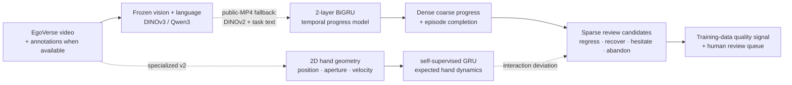
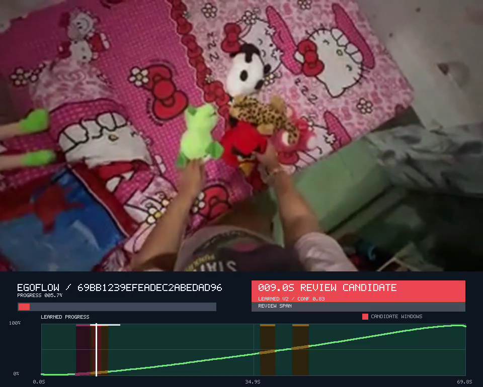

# EgoFlow

EgoFlow audits long-horizon egocentric demonstrations by learning coarse task
progress and surfacing hesitation, regression, recovery, and abandonment windows
for human review.

**Input:** long egocentric video · **Output:** dense progress, completion score,
and short review windows · **Scale:** 18 episodes / 25 minutes · **Training:**
frozen visual features with small temporal heads on Modal.

> **Headline result:** a self-supervised hand-dynamics model trained on 12 whole
> episodes flags the held-aside Angry Bird review moment at 8.433–9.833 seconds
> (14.42 robust MAD), inside the human 8–13 second label. The full review index
> spans 18 public clips / 25.0 minutes; blind-test results remain separately reported.

**Prospective check:** a separately frozen 12/3/3 episode split keeps Angry Bird
in validation and reserves three previously unreviewed videos for blind test. On
those 4.35 minutes, EgoFlow queues five hesitation windows totaling 12.25 seconds.
Post-prediction review found one correct, two ambiguous, and two incorrect.





Two neural heads are trained: a temporal progress model and a self-supervised
hand-dynamics predictor. Event motifs may also use disclosed visual or geometric
evidence; every interval retains its detector source. Human timestamp labels are
validation—not training targets.

## Why

Long demonstrations can finish while still containing costly pauses, backtracking,
failed attempts, or abandoned actions. A single success label hides those moments;
watching every frame does not scale. EgoFlow turns a demonstration into a dense
progress trace, an episode-level completion score, and a compact queue of suspicious
windows for a human curator.

## Method

Frozen visual and language encoders produce cached per-frame features. A projection
layer and two-layer bidirectional GRU (594,561 trainable parameters in the real run)
learn local progress with within-stage temporal ranking, endpoint anchoring, and
smoothness losses. Frame indices, timestamps, and normalized episode time are not
model inputs.

The data adapter supports native EgoVerse Zarr arrays, including DINO features and
Qwen annotations. The submitted public-video run only exposes MP4s, so it uses
frozen DINOv2 features plus task text and has one semantic stage. Consequently,
local and global progress are identical in these artifacts: this is **single-stage
coarse progress**, not hierarchical semantic progress.

## Hesitation / Recovery Detection

The output keeps its evidence sources separate:

- **LEARNED:** coarse progress from the BiGRU. The visualization centers its rate
  against a five-second rolling-median expectation. The presentation flips the
  sign to `(expected_rate - actual_rate) / MAD(actual_rate)`, so suspicious
  slowdowns rise upward while faster-than-expected motion falls downward.
- **LEARNED INTERACTION:** a separate two-layer GRU learns to predict the next
  2D hand state from position, aperture, and velocity. Robust prediction surprise
  creates sparse interaction-deviation candidates without timestamp supervision.
- **DERIVED:** sparse regression, hesitation, recovery, and abandonment
  *candidates* may combine learned progress deviations with
  frozen-DINO visual slowdown or loop-back evidence. The UI deliberately does not
  equate low progress rate with a human-semantic “stall” or positive rate with
  productive work.
- **HAND-GEOMETRY BASELINE:** video-only MediaPipe palm centers, hand aperture, and
  redirection geometry propose `ABORTED REACH?` windows while excluding stationary
  waiting, clear close/open grasp cycles, and camera-coupled bimanual motion. This
  lane is not part of the frozen metrics. A validation-tuned variant produces 90
  candidates across 18 clips and marks 8.267–10.133 s in the known 8–13 s hero
  span. It is shown as `HAND / EXPERIMENTAL`, not as held-out accuracy.
- **HUMAN VALIDATION:** nine timestamp spans were reviewed manually; eight precise
  hesitation/abandon labels enter the reported comparison, while one broad `other`
  span is excluded.

Every proposed event records its detector, including
`learned_progress_normalized`, `learned_hand_dynamics_v2`,
`hybrid_learned_progress_visual_dynamics`, `frozen_visual_dynamics`, or
`video_hand_geometry_v1`. EgoFlow is therefore presented as a review and
data-curation system, not a production-ready behavioral classifier.

## Distributed Pipeline

```text
public videos / authorized Zarr episodes
        ├── up to 8 short-lived Modal L40S feature workers (4 FPS)
        └── cached frozen features
                     ↓ as soon as the first tranche is ready
              1–2 Modal H100 trainers
                     ↓
              scoring + JSON + timelines
```

The coordinator starts training before all extraction jobs finish. It enforces
caps of 60 episodes, 8 extraction workers, 2 trainers, 2,500 steps, 25 minutes per
training job, and a conservative estimated-compute guard below $250. The final
frozen run used one H100 trainer and selected its step-100 checkpoint after early
stopping at step 400; training took 15.35 seconds. Its whole-episode split is 12
train / 3 validation / 3 blind test, with Angry Bird in validation and all three
test episodes marked `unreviewed` beforehand.

## Results

| Measure | Result | Interpretation |
|---|---:|---|
| Public episodes processed | 18 / 25.0 min | All selected clips were scored at 4 FPS |
| Manual evaluation subset | 7 episodes / 8.9 min | Tiny, same-set human audit |
| Tagged events recovered | 5 / 8 (62.5%) | 1.5 s overlap tolerance |
| Unmatched proposals | 16 | 21 reviewed hesitation/abandon windows total |
| Review-queue duration | 59.25 s | 11.1% of manually reviewed video |
| Blind-test video | 3 episodes / 4.35 min | Entire episodes, all unreviewed before prediction |
| Blind-test within-episode ranking | 0.9982 | 183,639 pairs; time-fraction baseline is 1.0000 |
| Final-frame cosine baseline | 0.5759 | Same blind-test ranking protocol |
| Mean completion, 25/50/75/100% prefixes | 0.9132 / 0.9426 / 0.9560 / 0.9608 | True prefix re-inference; full exceeds every truncation |
| Mean drop score, 25/50/75/100% prefixes | 0.0868 / 0.0574 / 0.0440 / 0.0392 | `1 - completion`; lower is better |
| Frozen top-five review queue | 1 correct / 2 ambiguous / 2 incorrect | 20% strict precision; 60% including ambiguous |
| Review duration reduction | 12.25 s from 260.75 s | 4.7% of blind-test video |
| Injected stall / reverse response | AUX 3/3 / 3/3; learned reverse 0/3 | Visual event layer reacts; coarse learned reward does not |

The Angry Bird hero span is human-labeled `8–13 s`; the system proposes
`8–11 s` as **HYBRID** evidence. These event numbers are same-set calibration
results, not held-out classifier accuracy. Chronology is a strong baseline, and the
completion experiment shows the correct ordering but remains poorly calibrated.
The blind-test numbers and frozen split are committed in
[`blind_test_metrics.json`](hackathon/egoflow/results/blind_test_metrics.json) and
[`frozen_split.json`](hackathon/egoflow/results/frozen_split.json).
The separately attributed hand-v2 probe is recorded in
[`hand_v2_validation.json`](hackathon/egoflow/results/hand_v2_validation.json).
The new learned short-horizon dynamics result is recorded in
[`interaction_v2_validation.json`](hackathon/egoflow/results/interaction_v2_validation.json).

MilliAudit is an optional, separate module under
[`hackathon/milliaudit`](hackathon/milliaudit). It tests millimeter-scale Eva IK
sensitivity, but its current trajectory is FK-generated; its 216/216 solver
successes validate the harness only and are not empirical retargeting evidence.

## Quickstart

Python 3.11+ is required. The credential-free demo path is three commands:

```bash
pip install -e .
python scripts/smoke_test.py
python scripts/run_demo.py --episode 69bb1239efeadec2abedad96
```

The smoke test creates temporary synthetic caches, trains a tiny head for three
CPU steps, checks progress shape/range, scores one episode, and deletes its scratch
data. The demo command opens no network connection; it reports the bundled curated
hero result. Pass a score JSON path to render your own timeline.

## Reproducing the Demo

Run the two-episode Modal smoke separately (Modal authentication is required, but
no EgoVerse or ElevenLabs secret is required for the selected public videos):

```bash
modal run hackathon/egoflow/modal_app.py --action smoke --max-episodes 2 --max-steps 20
```

Run all selected public episodes:

```bash
modal run hackathon/egoflow/modal_app.py \
  --action full \
  --episode-ids-file hackathon/egoflow/episode_selection.csv \
  --max-episodes 18 --max-steps 750 --training-runs 1
```

For an authorized local Zarr episode, follow the extraction/training/scoring
commands in [`hackathon/egoflow/README.md`](hackathon/egoflow/README.md). Dataset
caches and checkpoints are intentionally excluded from Git.

## Manual Evaluation

For presentation, generate the searchable SQLite-backed catalog with only the
featured episode IDs. It shows learned progress, learned-v2 interaction events,
reviewed spans, and direct video links. The public surface intentionally hides
legacy hybrid/auxiliary layers; their provenance remains in archived evaluation
JSON.

```bash
uv run python -m hackathon.egoflow.scripts.build_review_database \
  hackathon/egoflow/results/frozen/RUN/all_scores \
  --database hackathon/egoflow/results/presentation/egoflow-review.sqlite \
  --manual-labels hackathon/egoflow/manual_labels.jsonl \
  --featured-episode 69bb1239efeadec2abedad96 \
  --dashboard hackathon/egoflow/results/presentation/index.html
open hackathon/egoflow/results/presentation/index.html
```

Add `--video-dir`, `--hand-events-dir`, and `--interaction-events-dir` to link
local videos. A private research view can add `--include-research-events`; the
public presentation remains learned-v2 plus reviewed spans. Add `--slice-dir DIR`
to export ≥10-second clean spans later; source videos and generated slices stay
ignored.

Episode selection is in
[`hackathon/egoflow/episode_selection.csv`](hackathon/egoflow/episode_selection.csv),
and the compact human audit is in
[`hackathon/egoflow/manual_labels.jsonl`](hackathon/egoflow/manual_labels.jsonl).
The committed hero summary lists every source-attributed interval; exhaustive run
outputs are reproducible but excluded because they contain generated caches and
checkpoints.

The prospective top-five queue is frozen in
[`blind_test_review_queue.json`](hackathon/egoflow/results/blind_test_review_queue.json).
Its predictions were committed before review; the file now contains the subsequent
human verdicts. HYBRID proposals were 1/2 strictly correct and 2/2 including the
ambiguous example, while AUX proposals were 0/3 strictly correct and 1/3 including
ambiguous. The three complete scored videos are generated locally and ignored by
Git because each is 10–20 MB.

Labels are matched by episode and class when predicted/manual intervals overlap
within 1.5 seconds. False positives are unmatched predictions for label classes
represented on the seven reviewed episodes. This is deliberately a count-based
small-sample audit, not a population estimate.

## Limitations

- The manual evaluation is tiny, same-set, and covers only seven episodes.
- Hesitation is inherently ambiguous; slowdown can be careful productive motion.
- Progress-rate bins are not action semantics. A low rate may be careful productive
  manipulation, so scored videos remain neutral on ordinary frames instead of
  claiming `STALL` or `PRODUCTIVE`.
- Public MP4s lack the dense semantic annotations available in private EgoVerse
  Zarr data, so this run cannot demonstrate hierarchical local/global progress.
- The progress ranking metric is close to a trivial time-fraction baseline, and
  truncation completion scores are ordered but weakly separated.
- Injected stalls and reversals trigger the disclosed frozen-visual event layer
  on 3/3 blind episodes, but reversal does not reverse the learned progress signal
  (0/3); synthetic robustness is not a learned-reward claim.
- Frozen-visual heuristics contribute many event proposals (16 unmatched in the
  reviewed subset); they are disclosed separately from learned progress.
- The centered residual is retained as an analysis diagnostic, not a hesitation
  classifier. The presentation overlay instead shows one progress curve with
  sparse, source-aware candidate bands.
- A separate self-supervised two-layer GRU now learns expected 2D hand dynamics
  from 12 training episodes. The selected 32-unit model flags 8.433–9.833 s in
  Angry Bird validation at 14.42 MAD surprise. This is a learned interaction
  deviation—not object-aware proof of an aborted reach—and its newly frozen blind
  queue still requires prospective review.
- The experimental 2D hand detector has no object identity or persistence model;
  turns during completed transports can resemble aborted reaches. Its 90 proposals
  on 18 clips were not prospectively reviewed; the hero match was validation-tuned.
- MilliAudit's FK-generated IK fragility smoke test does not prove physical robot
  failure or reproduce an empirical retargeted trajectory.
